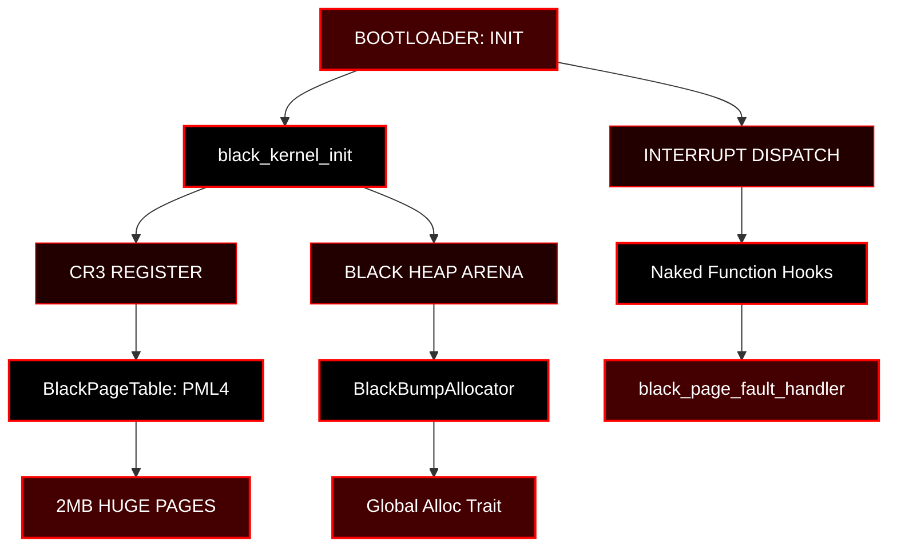

<div align="center">


<p align="center">
  
</p>

<br/>

[](https://github.com/BLACK0X80/BLACK-METAL-KERNEL)
[](https://github.com/BLACK0X80/BLACK-METAL-KERNEL)
[](https://black0x80.github.io/BLACK-METAL-KERNEL/BLACK)
[](LICENSE)
[](https://github.com/BLACK0X80/BLACK-METAL-KERNEL)

[](https://github.com/BLACK0X80/BLACK-METAL-KERNEL)
[](https://github.com/BLACK0X80/BLACK-METAL-KERNEL)
[](https://github.com/BLACK0X80/BLACK-METAL-KERNEL)

<br/>

**NO APOLOGIES • NO GARBAGE COLLECTION • NO MERCY**

BLACK METAL KERNEL IS A RAW, ZERO-COST SYSTEMS ENGINEERING MANIFESTO. WRITTEN ENTIRELY IN RUST, IT FORCES HARDWARE TO ITS KNEES. THERE ARE NO COMFORT LAYERS. EVERY CYCLE IS ACCOUNTED FOR. EVERY MEMORY ALLOCATION IS FATAL IF MISHANDLED. THIS IS KERNEL DEVELOPMENT REDUCED TO ITS ABSOLUTE, BRUTAL CORE.

[**READ LIVE TRANSMISSIONS AND TUTORIALS**](https://black0x80.github.io/BLACK-METAL-KERNEL/BLACK) • [**SYSTEM ARCHITECTURE**](#system-architecture) • [**HARDWARE CONTROL**](#hardware-interfaces)

</div>

---

## SYSTEM MANIFESTO

<table>
<tr>
<td valign="top" width="50%">

**THE RULES EXECUTED**
- [The Black Philosophy](#the-black-philosophy)
- [System Constraints](#system-constraints)
- [Memory Bounding](#memory-bounding)

</td>
<td valign="top" width="50%">

**DEPLOYMENT MECHANICS**
- [Compilation Directives](#compilation-directives)
- [Initialization Sequence](#initialization-sequence)
- [System Architecture](#system-architecture)

</td>
</tr>
</table>

---

## THE BLACK PHILOSOPHY

<div align="center">

**ABSOLUTE BARE-METAL DOMINANCE.**

</div>

MODERN SOFTWARE IS BLOATED AND WEAK. ABSTRACTIONS HIDE INCOMPETENCE. BLACK METAL KERNEL TEARS DOWN ABSTRACTIONS UNTIL ONLY THE HARDWARE REMAINS. IF IT COMPILES, IT OWNS THE ADDRESS SPACE.

<table>
<tr>
<td align="center" width="33%">

**FATAL MEMORY**

Zero Garbage Collection
<br/>
Bump Allocation
<br/>
Strict Bound Checks
<br/>
Fatal Panics

</td>
<td align="center" width="33%">

**NAKED INTERRUPTS**

Raw CPU States
<br/>
No Context Stubs
<br/>
Direct IDT Execution
<br/>
Hardware Precision

</td>
<td align="center" width="33%">

**ZERO COMMENTS**

Code Speaks For Itself
<br/>
`black_` Prefix Enforced
<br/>
No Human Interpretations
<br/>
Read The Assembly

</td>
</tr>
</table>

<div align="center">

| LAYER | TRADITIONAL KERNELS | BLACK METAL KERNEL |
|:-----:|:-------------------:|:------------------:|
| **Documentation** | Meaningless Comments | Zero Comments. Pure Syntax. |
| **Paging** | 4KB Dynamic Mapping | 2MB Huge Pages (CR3 Direct Map) |
| **Concurrency** | Heavy Thread Scheduling | UnsafeCell Spinlocks (TTAS) |
| **Interrupts** | Trampoline Handlers | Naked Hardware Endpoints |
| **Memory Matrix**| Paged Heaps | Unified Arena Bounding |

</div>

---

## HARDWARE INTERFACES

<table>
<tr>
<td width="50%" valign="top">

**CORE SYNCHRONIZATION (`black_sync`)**

```rust
Locking: Two-Phase TTAS Spinlocks
Mutability: Bound by UnsafeCell
Execution: Rust RAII guards drop execution locks automatically upon scope exit.
```

**MEMORY APPARATUS (`black_allocator`)**

```rust
Topology: Lock-Free Bump Allocator
Confinement: 4MB Aligned Unified Arena
Speed: AtomicUsize compare_exchange_weak ensures zero kernel-mode locking contention.
```

</td>
<td width="50%" valign="top">

**EXECUTION ENVIRONMENT (`black_interrupts`)**

```rust
Registers: repr(C) strict bounding.
Faults: Assembly direct pass-through.
Design: #![feature(naked_functions)] obliterates compiler prologues.
```

**ADDRESS SPACE CONTROL (`black_paging`)**

```rust
CR3: Total Overwrite.
Mapping: Linear Direct Address Translation.
Speed: Complete TLB bypass with 2MB huge blocks globally.
```

</td>
</tr>
</table>

---

## COMPILATION DIRECTIVES

<div align="center">

| REQUIREMENT | VERSION | PROTOCOL |
|:-----------:|:-------:|:---------|
| RUSTC | `nightly-2026+` | `asm_const, allocator_api, naked_functions` |
| ARCHITECTURE | `x86_64` | `target_os="none"` |
| PROLOGUE | `nasm` | Initial bootloader hook configuration |

</div>

**BUILD PROMPT**

```bash
cargo rustc --target x86_64-unknown-none --release
```

---

## INITIALIZATION SEQUENCE

<div align="center">

**THE KERNEL DOES NOT ASK FOR CONTROL. IT SEIZES IT.**

</div>

```rust
pub unsafe fn black_kernel_init() -> ! {
    crate::black_allocator::black_heap_init();
    
    let mut black_pml4 = crate::black_paging::BlackPageTable::black_zeroed();
    black_pml4.black_map_huge(0, 0, crate::black_paging::BLACK_PAGE_WRITABLE);
    black_pml4.black_load();

    core::arch::asm!("sti", options(nomem, nostack));

    loop {
        core::arch::asm!("hlt", options(nomem, nostack));
    }
}
```

---

## SYSTEM ARCHITECTURE

<div align="center">


</div>

---

## LICENSE PROTOCOL

<div align="center">

**BLACK METAL KERNEL OPERATES UNDER THE MIT LICENSE.**

</div>

```text
MIT License

Copyright (c) 2026 BLACK0X80

Permission is hereby granted, free of charge, to any person obtaining a copy
of this software and associated documentation files (the "Software"), to deal
in the Software without restriction, including without limitation the rights
to use, copy, modify, merge, publish, distribute, sublicense, and/or sell
copies of the Software, and to permit persons to whom the Software is
furnished to do so, subject to the following conditions:

The above copyright notice and this permission notice shall be included in all
copies or substantial portions of the Software.

THE SOFTWARE IS PROVIDED "AS IS", WITHOUT WARRANTY OF ANY KIND, EXPRESS OR
IMPLIED, INCLUDING BUT NOT LIMITED TO THE WARRANTIES OF MERCHANTABILITY,
FITNESS FOR A PARTICULAR PURPOSE AND NONINFRINGEMENT. IN NO EVENT SHALL THE
AUTHORS OR COPYRIGHT HOLDERS BE LIABLE FOR ANY CLAIM, DAMAGES OR OTHER
LIABILITY, WHETHER IN AN ACTION OF CONTRACT, TORT OR OTHERWISE, ARISING FROM,
OUT OF OR IN CONNECTION WITH THE SOFTWARE OR THE USE OR OTHER DEALINGS IN THE
SOFTWARE.
```

---

<div align="center">

## BLACKOUT IMMINENT

```bash
cargo build --release
```

<br/>

[](https://github.com/BLACK0X80/BLACK-METAL-KERNEL/stargazers)
[](https://github.com/BLACK0X80/BLACK-METAL-KERNEL)

<br/><br/>

**ENGINEERED BY BLACK • 2026**

*HARDWARE SUBMISSION. NO ABSTRACTIONS.*

<br/>


</div>
